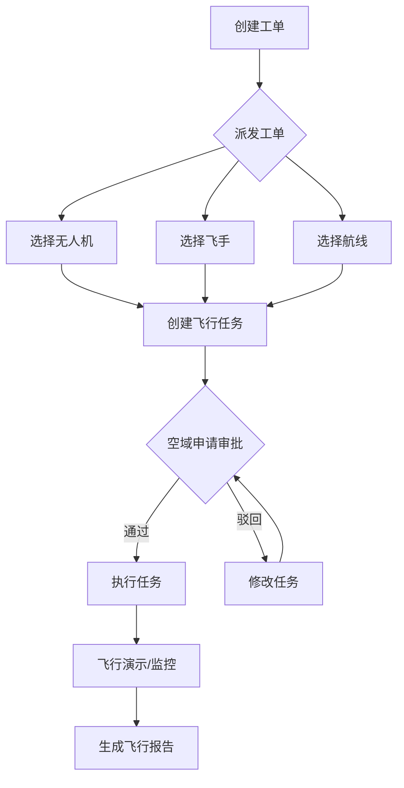
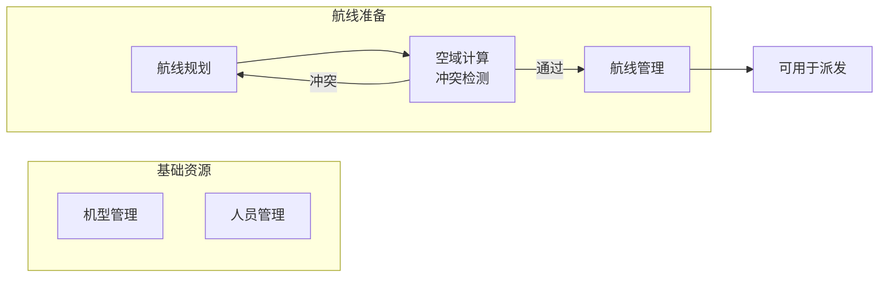
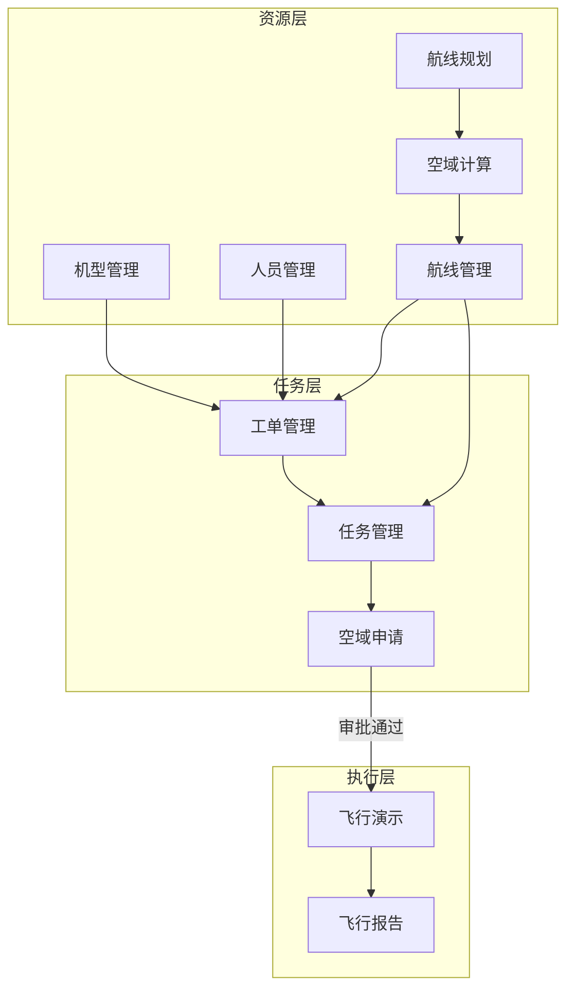

# 无人机飞行管理平台 - 系统流程梳理与优化建议

## 系统概览

本平台是一个完整的无人机飞行管理系统，涵盖从任务规划到执行监控的全流程。

---

## 核心业务流程

### 1. 主流程：工单驱动的飞行任务执行



| 步骤 | 入口模块 | 说明 |
|------|---------|------|
| ① 创建工单 | 工单管理 | 填写任务需求、优先级、位置信息 |
| ② 派发工单 | 工单管理 | 指派无人机、飞手、航线 |
| ③ 空域审批 | 空域申请 | 飞行任务合规审批 |
| ④ 任务执行 | 任务管理 | 查看任务列表，执行飞行任务 |
| ⑤ 飞行监控 | 飞行演示 | 3D 地图实时展示飞行轨迹 |
| ⑥ 报告管理 | 飞行报告 | 查看历史飞行记录和报告 |

---

### 2. 资源准备流程



| 模块 | 功能 | 数据流向 |
|------|------|----------|
| **机型管理** | 维护无人机机型库 | → 工单派发(选择无人机) |
| **人员管理** | 维护飞手信息和状态 | → 工单派发(选择飞手) |
| **航线规划** | 创建和编辑航线 | → 空域计算 → 航线管理 |
| **空域计算** | 航线安全性检测 | 禁飞区冲突、高度限制检测 |
| **航线管理** | 查看、删除、管理航线 | → 工单派发/任务管理 |

---

### 3. 空域管理流程

#### 空域计算（航线规划后）
```
航线规划完成 → 空域计算 → 禁飞区冲突检测 + 高度限制检测 → 通过后保存航线
```

#### 空域申请（任务执行前）
```
飞行任务创建 → 空域申请提交 → 审批(通过/驳回) → 执行飞行
```

---

### 4. 完整数据流转关系



---

## 当前功能状态

| 模块 | 状态 | 关键功能 |
|------|------|----------|
| 工单管理 | ✅ | 创建/编辑/派发/删除工单 |
| 任务管理 | ✅ | 创建/执行/删除任务，分配航线 |
| 机型管理 | ✅ | CRUD、状态管理 |
| 人员管理 | ✅ | 飞手列表、状态管理 |
| 航线规划 | ✅ | 航点绘制、航线保存 |
| 航线管理 | ✅ | 列表预览、批量删除 |
| **空域计算** | ✅ | 禁飞区冲突、高度限制检测 |
| **空域申请** | ✅ | 飞行任务审批流程 |
| 飞行演示 | ✅ | 3D 飞行模拟、轨迹展示 |
| 飞行报告 | ✅ | 报告列表、详情查看 |

---

## 待完善功能建议

### 高优先级 🔴

| 功能 | 说明 |
|------|------|
| 任务状态自动流转 | 飞行完成后自动更新任务/工单/飞手状态 |
| 任务执行前校验 | 检查航线是否存在、是否通过空域审批 |
| 工单与任务双向关联 | 工单详情页显示关联的飞行任务 |
| **空域申请与任务关联** | 任务创建时自动生成空域申请 |

### 中优先级 🟡

| 功能 | 说明 |
|------|------|
| 航线保存时自动触发空域计算 | 规划完成自动检测冲突 |
| 航线预览 | 任务列表点击航线名称可预览 |
| 批量操作 | 批量删除、批量状态变更 |
| 数据统计仪表板 | 任务完成率、飞行时长统计 |

---

## 下一步行动计划

1. [x] 实现任务状态自动流转 ✅ (飞行完成后自动更新任务状态为已完成)
2. [x] 实现飞手状态自动恢复 ✅ (任务完成后飞手状态恢复为空闲)
3. [x] 任务创建时自动生成空域申请 ✅ (工单派发时自动创建空域申请)
4. [x] 航线保存后自动触发空域计算 ✅ (航线保存后提示用户进行空域计算)
5. [x] 工单详情页关联任务展示 ✅ (详情页显示关联任务名称和状态)
